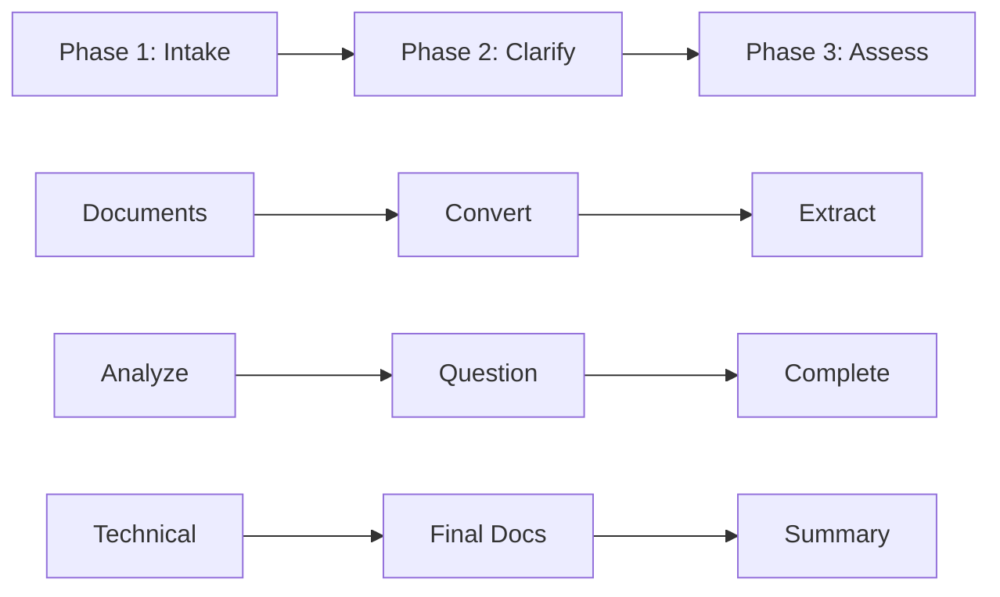

# ER Agent - Enhancement Requirements Analyzer

## Overview

The ER (Enhancement Requirements) Agent is a streamlined tool for transforming business enhancement requests into clear, actionable technical specifications. It's a simplified version of the comprehensive SRD Agent, focused on speed and clarity while maintaining quality.

## Quick Start

```bash
# Invoke the ER Agent
/er

# Or with initial documents
/er path/to/requirements/folder
```

## Key Features

### 📄 Document Conversion
- Automatically converts multiple document formats to markdown
- Supports: `.docx`, `.pptx`, `.xlsx`, `.pdf`, `.txt`, `.md`, `.csv`
- Preserves formatting and structure for analysis

### ❓ Interactive Clarification
- Smart question generation based on requirement analysis
- Two-tier priority system (Critical vs Clarifications)
- Interactive Q&A loop with skip options
- Tracks all questions and answers for audit trail

### 📊 Completeness Assessment
- Evaluates requirements across 4 key categories
- Provides percentage scores and recommendations
- Identifies gaps and risks before development

### 🔧 Technical Assessment
- Feasibility analysis for each requirement
- Effort estimation using T-shirt sizing (S/M/L/XL)
- Risk identification and mitigation strategies
- Technical approach recommendations

### 📁 Organized Output
- Clean folder structure with timestamped sessions
- Separation of input, processing, and output artifacts
- Professional documentation ready for stakeholders

## Workflow



### Phase 1: Document Intake & Conversion
1. Creates timestamped session folder
2. Collects source documents
3. Converts all documents to markdown
4. Extracts initial requirements

### Phase 2: Clarification & Assessment
1. Analyzes requirements for issues
2. Generates prioritized questions
3. Runs interactive Q&A session
4. Updates requirements with answers
5. Produces completeness report
6. Gate decision: proceed or gather more info

### Phase 3: Technical Assessment & Documentation
1. Evaluates technical feasibility
2. Estimates implementation effort
3. Identifies risks and mitigations
4. Generates final requirements document
5. Creates executive summary

## Output Structure

```
analysis/
└── ER-20240312-1430/          # Unique session
    ├── input/                  # Original documents
    │   └── converted/          # Markdown versions
    ├── processing/             # Working files
    │   ├── requirements.md     # Consolidated requirements
    │   ├── questions.md        # Q&A history
    │   └── completeness.md     # Assessment report
    └── output/                 # Deliverables
        ├── tech-assessment.md  # Technical analysis
        ├── final-requirements.md # Complete specification
        └── summary.md          # Executive summary
```

## Completeness Categories

The agent assesses requirements across four essential dimensions:

| Category | Focus Area | Example Elements |
|----------|------------|------------------|
| **Functional** | What the system does | Features, capabilities, workflows |
| **Data** | Information handling | Schemas, storage, transformations |
| **User Experience** | How users interact | UI requirements, workflows, accessibility |
| **Technical Constraints** | Limitations & requirements | Performance, security, integration |

## Effort Sizing Guide

| Size | Duration | Typical Scope |
|------|----------|---------------|
| **S (Small)** | 1-2 weeks | Simple features, minor changes |
| **M (Medium)** | 2-4 weeks | Moderate complexity, some integration |
| **L (Large)** | 1-3 months | Complex features, significant changes |
| **XL (Extra Large)** | 3+ months | Major initiatives, architectural changes |

## Example Usage

### Basic Enhancement Request
```bash
/er

# Agent prompts for documents
> Please specify document locations: ./requirements/feature-request.docx

# Agent converts and analyzes
# Presents clarifying questions
# Generates assessments and final docs
```

### Batch Document Processing
```bash
/er ./requirements/

# Processes all documents in folder
# Consolidates into single requirement set
```

## Best Practices

### Before Using ER Agent
1. Gather all relevant requirement documents
2. Ensure documents are in supported formats
3. Have stakeholders available for clarifying questions
4. Know your completeness threshold (typically 80%)

### During ER Session
1. Answer Priority 1 questions first (critical issues)
2. Provide specific, detailed answers when possible
3. Use "skip" sparingly - deferred questions add risk
4. Review completeness score before proceeding

### After ER Completion
1. Share tech assessment with development team
2. Review final requirements with stakeholders
3. Use output documents for project planning
4. Archive session folder for audit trail

## Comparison with SRD Agent

| Aspect | ER Agent | SRD Agent |
|--------|----------|-----------|
| **Purpose** | Enhancement requests | Full solution design |
| **Phases** | 3 phases | 13 phases |
| **Complexity** | Simplified | Comprehensive |
| **Duration** | 30-60 minutes | 2-4 hours |
| **Output Docs** | 5 documents | 15+ documents |
| **Best For** | Feature additions | New systems |

## Integration Points

### Input Sources
- Business requirement documents
- Email feature requests
- Meeting notes
- User feedback compilations
- Legacy system documentation

### Output Consumers
- Development teams (tech assessment)
- Product managers (requirements)
- Stakeholders (summary)
- QA teams (test planning)
- Project managers (effort estimates)

## Troubleshooting

### Common Issues

**Document conversion fails**
- Ensure Python environment is activated
- Check markitdown is installed: `pip install markitdown`
- Try converting to .txt first as fallback

**Low completeness scores**
- Review source documents for detail level
- Run additional clarifying question rounds
- Consider gathering more requirements

**Technical assessment unclear**
- Use interactive review option in Phase 3
- Provide more technical constraints
- Involve technical team earlier

## Version History

- **v1.0.0** (2024-03-12): Initial release
  - Simplified from SRD Agent
  - Core features: conversion, clarification, assessment
  - 3-phase streamlined workflow

## Future Roadmap

- [ ] Visio (.vsdx) file support
- [ ] Jira integration options
- [ ] Multi-session capabilities
- [ ] Custom completeness categories
- [ ] API for external integrations
- [ ] Batch processing mode

## Support

For questions, issues, or enhancement requests:
- Review this documentation
- Check the CHANGELOG-er.md for recent updates
- Contact the development team

## License

This agent is part of the SA-Agent suite and follows the same licensing terms.

---

*ER Agent - Turning enhancement requests into actionable specifications with clarity and speed.*