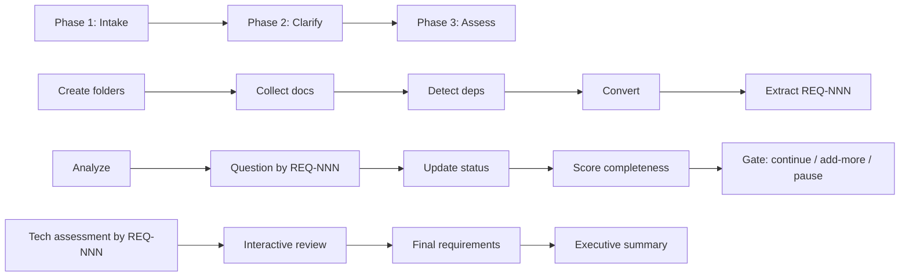

# ER Agent - Enhancement Requirements Analyzer

## Overview

The ER (Enhancement Requirements) Agent is a streamlined tool for transforming business enhancement requests into clear, actionable technical specifications. It's a simplified version of the comprehensive SRD Agent, focused on speed and clarity while maintaining quality.

All requirements are tagged with unique IDs (`REQ-001`, `REQ-002`, etc.) for full traceability from extraction through technical assessment.

## Quick Start

```
# Invoke the ER Agent
/er
```

1. The agent runs **state detection** first — if a previous session exists, it resumes automatically
2. If starting fresh, it creates the session folder and prompts you to provide documents or type requirements
3. Follow the three-phase workflow to produce a complete technical specification

## Key Features

### Document Conversion
- Automatically converts multiple document formats to markdown via markitdown
- Supported formats: `.docx`, `.pptx`, `.xlsx`, `.xls`, `.pdf`, `.html`, `.htm`, `.csv`, `.json`, `.xml`, `.eml`, `.txt`, `.md`
- Dynamic dependency detection — only installs the markitdown extras needed for your actual files
- `.eml` files converted via Python stdlib `email` module (no pip install needed — extracts subject, from, to, date, body)
- Skips venv entirely if only text files (`.md`, `.txt`) are present
- Base-package conversion fallback — if markitdown fails on csv/json/xml/html, copies the original file as-is (already text-readable)

### Interactive Clarification
- Smart question generation referencing specific `REQ-NNN` IDs
- Two-tier priority system (Critical vs Clarifications)
- Interactive Q&A loop with `skip` and `skip-all` options
- Tracks all questions and answers for audit trail

### Completeness Assessment
- Evaluates requirements across 4 key categories with `REQ-NNN` traceability
- Provides percentage scores and recommendations
- Identifies gaps and risks before development

### Technical Assessment
- Feasibility analysis for each requirement by `REQ-NNN`
- Effort estimation using T-shirt sizing (S/M/L/XL)
- Risk identification and mitigation strategies linked to `REQ-NNN`
- Technical approach recommendations

### Resume Support
- File-based state detection runs on every invocation
- Automatically picks up where the last session left off
- No user coordination required — the agent detects progress from output files

### Organized Output
- Clean folder structure with timestamped sessions
- Separation of source, processing, and output artifacts
- All requirements tagged `REQ-NNN` for traceability across all documents

## Workflow



### Phase 1: Document Intake & Conversion
1. Generate session ID (`ER-YYYYMMDD-HHMM`)
2. Create folder structure (`source\`, `source\converted\`, `processing\`, `output\`)
3. Prompt user to place documents in `source\` or type requirements directly — wait for input
4. Scan file extensions, detect which markitdown extras are needed
5. Setup venv and install markitdown (only if binary formats present)
6. Convert documents one at a time; log errors without stopping
7. Extract requirements, tag as `REQ-NNN` with source and status metadata

### Phase 2: Clarification & Assessment
1. Analyze requirements by `REQ-NNN` for contradictions, ambiguities, and gaps
2. Generate prioritized clarifying questions referencing `REQ-NNN`
3. Run interactive Q&A session (Priority 1 critical first, then Priority 2)
4. Update requirement status by `REQ-NNN` (Confirmed / Deferred)
5. Score completeness across four categories with `REQ-NNN` traceability
6. Completeness gate: continue to tech assessment, go back for more, or export and pause

### Phase 3: Technical Assessment & Documentation
1. Evaluate technical feasibility by `REQ-NNN`
2. Estimate implementation effort (S/M/L/XL) with `REQ-NNN` breakdown
3. Identify risks and mitigations linked to `REQ-NNN`
4. Optional interactive tech review (walk through each section or skip)
5. Generate final requirements document with full `REQ-NNN` traceability
6. Create executive summary

## Output Structure

```
analysis\
└── ER-YYYYMMDD-HHMM\
    │
    │   ── Phase 1: Document Intake & Conversion ──
    ├── source\                      # User places documents here (Step 1.3)
    │   └── converted\               # Markitdown output (Step 1.5)
    │
    │   ── Phase 2: Clarification & Assessment ──
    ├── processing\
    │   ├── requirements.md          # Tagged requirements REQ-NNN (Step 1.6, updated in 2.4)
    │   ├── questions.md             # Prioritized clarifying questions (Step 2.2)
    │   └── completeness.md          # Completeness scoring report (Step 2.5)
    │
    │   ── Phase 3: Technical Assessment & Final Documentation ──
    └── output\
        ├── tech-assessment.md       # Feasibility, risk, effort (Step 3.1)
        ├── final-requirements.md    # Final requirements with REQ-NNN (Step 3.3)
        └── summary.md              # Executive summary (Step 3.4)
```

## State Detection (Resume Support)

The agent runs state detection **before anything else** on every invocation:

| Condition | Inferred State | Action |
|-----------|---------------|--------|
| No `ER-*` folder | Fresh start | Phase 1 from scratch |
| `ER-*` exists, no `processing\requirements.md` | Phase 1 incomplete | Resume at Step 1.3 or 1.4 |
| `processing\requirements.md` exists, no `processing\completeness.md` | Phase 2 incomplete | Resume at Step 2.1 |
| `processing\completeness.md` exists, no `output\tech-assessment.md` | Phase 2 complete | Re-present completeness gate |
| `output\tech-assessment.md` exists, no `output\summary.md` | Phase 3 incomplete | Resume at Step 3.3 |
| `output\summary.md` exists | Session complete | Offer `new` to start fresh |

Multiple `ER-*` sessions: the agent auto-picks the most recent by lexicographic sort.

## Supported File Types

| Category | Extensions | markitdown Extras | Notes |
|----------|-----------|-------------------|-------|
| Word | `.docx` | `docx` | Installed only if .docx files present |
| Excel | `.xlsx`, `.xls` | `xlsx` | Installed only if .xlsx/.xls files present |
| PowerPoint | `.pptx` | `pptx` | Installed only if .pptx files present |
| PDF | `.pdf` | `pdf` | Installed only if .pdf files present |
| HTML | `.html`, `.htm` | none (base) | Base markitdown handles these |
| Data | `.csv`, `.json`, `.xml` | none (base) | On conversion failure, copied as-is |
| Email | `.eml` | none (stdlib) | Python `email` module — extracts headers + body; needs venv but no pip install |
| Text | `.txt`, `.md` | none | Copied to `converted\` as-is; no venv needed |
| Unsupported | `.png`, `.jpg`, `.gif`, `.mp3`, `.wav`, `.zip`, `.epub` | n/a | Skipped with warning |

## Completeness Categories

The agent assesses requirements across four essential dimensions:

| Category | Focus Area | Example Elements |
|----------|------------|------------------|
| **Functional** | What the system does | Features, capabilities, workflows |
| **Data** | Information handling | Schemas, storage, transformations |
| **User Experience** | How users interact | UI requirements, workflows, accessibility |
| **Technical Constraints** | Limitations & requirements | Performance, security, integration |

## Effort Sizing Guide

| Size | Duration | Typical Scope |
|------|----------|---------------|
| **S (Small)** | 1-2 weeks | Simple features, minor changes |
| **M (Medium)** | 2-4 weeks | Moderate complexity, some integration |
| **L (Large)** | 1-3 months | Complex features, significant changes |
| **XL (Extra Large)** | 3+ months | Major initiatives, architectural changes |

## Best Practices

### Before Using ER Agent
1. Gather all relevant requirement documents
2. Ensure documents are in supported formats (see table above)
3. Have stakeholders available for clarifying questions
4. Know your completeness threshold (typically 80%)

### During ER Session
1. Answer Priority 1 questions first (critical issues)
2. Provide specific, detailed answers when possible
3. Use `skip` sparingly — deferred questions add risk
4. Review completeness score before proceeding to Phase 3

### After ER Completion
1. Share tech assessment with development team
2. Review final requirements with stakeholders — all tagged `REQ-NNN` for easy reference
3. Use output documents for project planning
4. Archive session folder for audit trail

## Comparison with SRD Agent

| Aspect | ER Agent | SRD Agent |
|--------|----------|-----------|
| **Purpose** | Enhancement requests | Full solution design |
| **Phases** | 3 phases | 13 phases (3 stages) |
| **Complexity** | Simplified | Comprehensive |
| **Duration** | 30-60 minutes | 2-4 hours |
| **Output Docs** | 6 documents | 15+ documents |
| **Requirement Tags** | REQ-NNN | REQ-NNN |
| **Resume Support** | Yes (file-based) | Yes (file-based) |
| **Best For** | Feature additions, enhancements | New systems, full solution design |

## Integration Points

### Input Sources
- Business requirement documents
- Email feature requests
- Meeting notes
- User feedback compilations
- Legacy system documentation

### Output Consumers
- Development teams (tech assessment)
- Product managers (requirements)
- Stakeholders (summary)
- QA teams (test planning)
- Project managers (effort estimates)

## Troubleshooting

### Common Issues

**Document conversion fails**
- The agent handles this automatically — per-file errors are logged to `source\converted\conversion-errors.md` without stopping
- For csv/json/xml/html failures, the original file is copied as-is
- If the venv or markitdown install fails, the agent stops — check Python is available and `scripts\venv\` is writable

**Low completeness scores**
- Review source documents for detail level
- Run additional clarifying question rounds (choose option `2` at the completeness gate)
- Consider gathering more requirements from stakeholders

**Technical assessment unclear**
- Use the interactive review option in Phase 3 (option `2` walks through each section)
- Provide more technical constraints in your source documents
- Involve the technical team earlier in the process

**Session interrupted**
- Just re-invoke the agent with `/er` — state detection automatically resumes where you left off
- No data is lost; progress is saved at each phase

## Version History

- **v1.2** (2026-03-16): Guardrails, state detection, Windows paths, REQ-NNN tagging
  - Added YAML frontmatter, DIRECTORY CONTAINMENT, STATE DETECTION, GUARDRAILS sections
  - File-based resume support (auto-detects where to pick up)
  - REQ-NNN requirement tagging throughout all phases
  - Windows path normalization (Linux/Mac commands removed)
  - Base-package conversion fallback (copy as-is on failure)
  - Dynamic markitdown dependency detection
- **v1.1** (2026-03-16): Source folder intake, dynamic dependencies
  - Replaced path prompt with SRD-style `source\` folder intake
  - Dynamic markitdown extras based on file extensions
  - Conditional venv (skipped for text-only files)
  - Folder rename: `input\` to `source\`
  - Expanded supported formats
- **v1.0** (2026-03-12): Initial release
  - Simplified from SRD Agent architecture
  - Core features: conversion, clarification, assessment
  - 3-phase streamlined workflow

---

*ER Agent v1.2 - Turning enhancement requests into actionable specifications with clarity and speed.*
